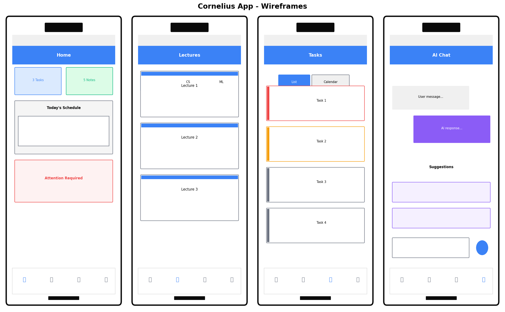
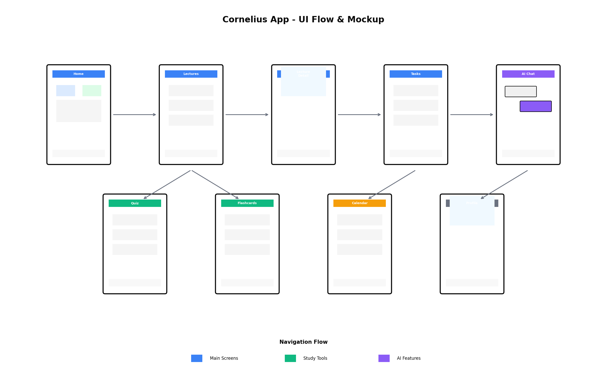
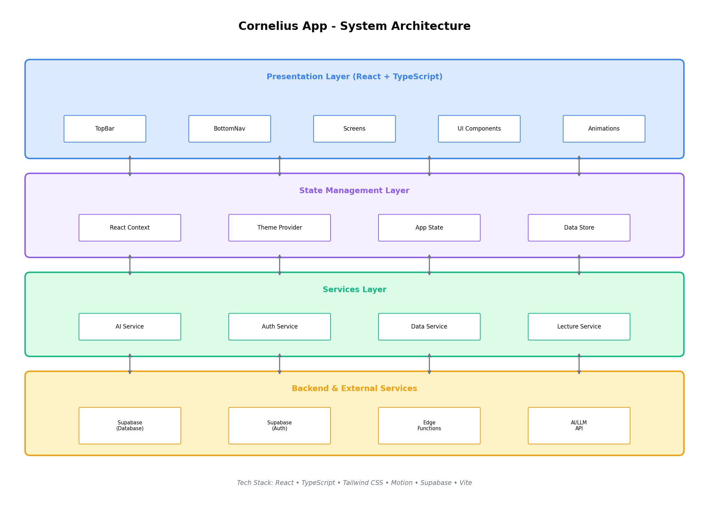
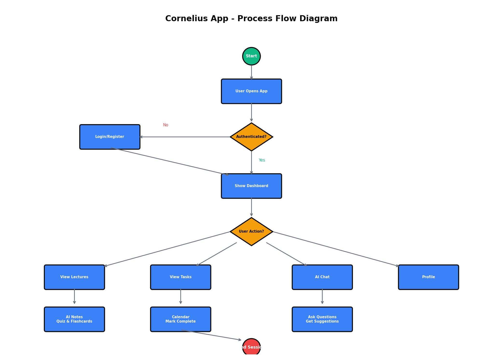

# Cornelius

**AI-Powered Smart Lecture Notes Platform**

Cornelius is a modern React-based mobile application that helps students manage their lectures, tasks, and study materials with AI-powered features.

## 🚀 Features

- **📚 Lecture Library** - Browse, filter, and view AI-generated lecture notes
- **📅 Task Calendar** - Manage assignments, labs, and exams with urgency tracking
- **🤖 AI Assistant** - Get study tips, generate quizzes, and create flashcards
- **🏠 Smart Dashboard** - View today's schedule, alerts, and AI suggestions
- **🌙 Dark Mode** - Beautiful dark/light theme support

## 📱 Screenshots & Wireframes

### Wireframes


### UI Flow


## 🏗️ System Architecture



### Tech Stack
- **Frontend:** React + TypeScript
- **Styling:** Tailwind CSS
- **Animations:** Motion (Framer Motion)
- **Build Tool:** Vite
- **Backend:** Supabase (Database + Auth)

## 📊 Design Documentation

### Process Flow Diagram


### Use Case Diagram


## 🛠️ Running the Code

### Prerequisites
- Node.js 18+
- npm or yarn

### Installation

```bash
# Install dependencies
npm install

# Start development server
npm run dev
```

### Build for Production

```bash
npm run build
```

## 📁 Project Structure

```
src/
├── components/
│   ├── layout/         # TopBar, BottomNavigation, AppShell
│   ├── screens/        # HomeDashboard, LecturesLibrary, TasksCalendar, AIChat
│   ├── shared/         # Reusable UI components
│   └── ui/             # Base UI elements
├── contexts/           # React Context providers (Theme)
├── data/               # Mock data for development
├── styles/             # Global CSS and Tailwind config
├── types/              # TypeScript interfaces
└── utils/              # Helper functions
```

## 📄 Documentation

Full design documentation including all diagrams is available in the `diagrams/` folder:
- `Cornelius_App_Diagrams.pdf` - Complete PDF with all diagrams
- Individual PNG files for each diagram

## 📱 Mobile Support

The app is optimized for mobile devices with:
- Fixed header and bottom navigation
- Touch-friendly UI elements
- Safe area inset support for notched devices
- Responsive layouts

## 🎨 Design System

- **Primary Color:** `#3b82f6` (Blue)
- **Secondary Color:** `#8b5cf6` (Purple)
- **Success:** `#10b981` (Emerald)
- **Warning:** `#f59e0b` (Amber)
- **Danger:** `#ef4444` (Red)

## 📝 License

MIT License